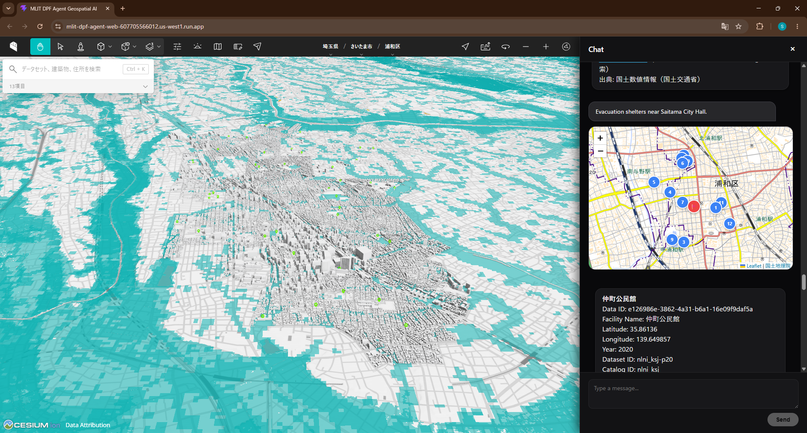
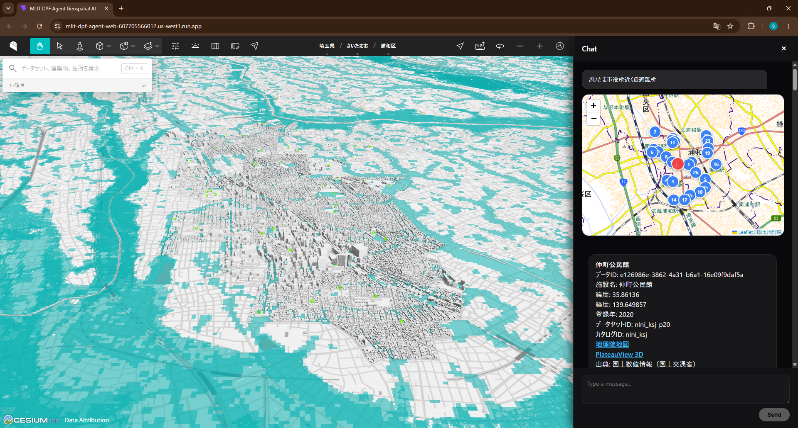
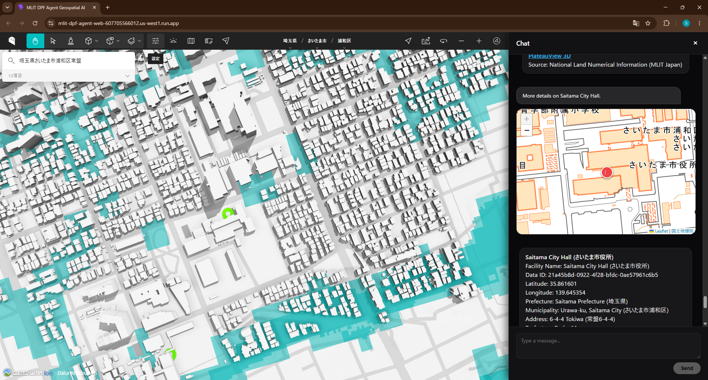
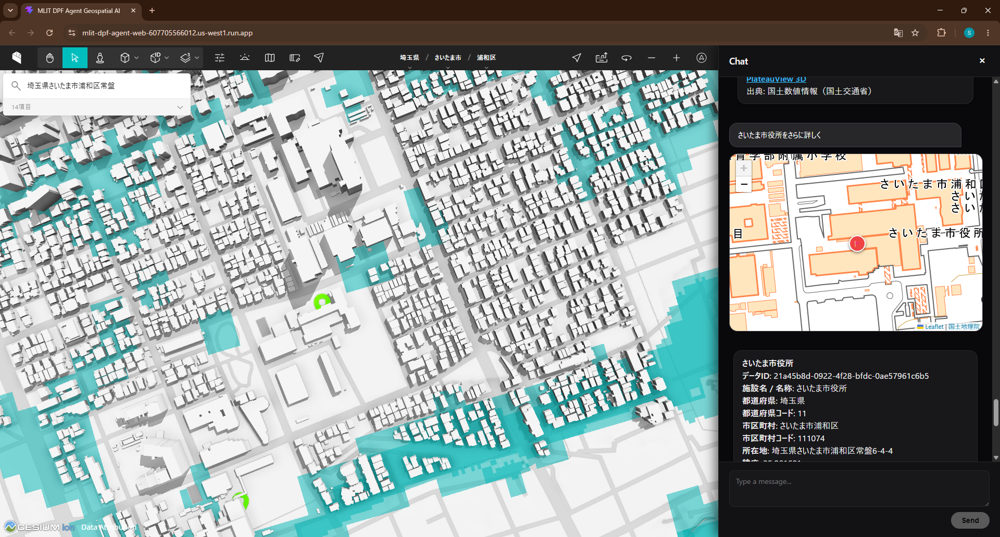

# mlit-dpf-agent

## Overview & Architecture

**`mlit-dpf-agent`** is an AI agent built with Google ADK that leverages **`mlit-dpf-mcp`** (MLIT Data Platform MCP Server) to ground LLM intelligence in official public data from Japan's Ministry of Land, Infrastructure, Transport and Tourism, seamlessly integrating with **PlateauView 3D** for geospatial exploration.

```
[ User Query ] ⇄ [ mlit-dpf-agent (ADK / Gemini) ]
                         └── [ mlit-dpf-mcp ] ⇄ [ MLIT Data Platform API ] ➔ [ PlateauView 3D ]
```

> ⚠️ **Disclaimer:** This is an unofficial community project and is not officially affiliated with or endorsed by the Ministry of Land, Infrastructure, Transport and Tourism (MLIT).

### Core Capabilities

1. **Public Goods MCP (`mlit-dpf-mcp` vs Maps Grounding Lite)**: While *Maps Grounding Lite* connects agents to commercial map data, **`mlit-dpf-mcp`** connects directly to national **Public Goods**—official geospatial datasets, urban infrastructure, and disaster prevention records.
2. **Public Goods Agent (`mlit-dpf-agent` vs Maps Agentic UI Toolkit)**: While the *Google Maps Agentic UI Toolkit* orchestrates commercial POI interactions, **`mlit-dpf-agent`** is purpose-built to navigate public administrative workflows and national open data.
3. **Public Goods Map (PlateauView 3D vs Google Maps)**: While standard solutions visualize onto commercial *Google Maps*, **`mlit-dpf-agent`** integrates with Japan's official **PlateauView 3D** for rich, open-standard 3D urban model exploration.

---

## Project Structure

```
mlit-dpf-agent/
├── app/                       # Core agent code
│   ├── agent.py               # Main agent logic & orchestration
│   ├── mlit_agent.py          # MLIT DPF specialized agent (SSE MCP client)
│   ├── fast_api_app.py        # FastAPI Backend server
│   └── app_utils/             # App utilities and helpers
├── skills/                    # Agent Skills (MLIT DPF)
│   ├── README.md              # Skills catalog
│   └── mlit-data-plathome/    # MLIT DPF MCP skill
├── tests/                     # Unit, integration, and E2E tests
├── GEMINI.md                  # AI-assisted development guide
└── pyproject.toml             # Project dependencies
```

---

## Requirements

Before you begin, ensure you have:
* **uv**: Python package manager - [Install](https://docs.astral.sh/uv/getting-started/installation/)
* **agents-cli**: Google Agents CLI - `uv tool install google-agents-cli`
* **Google Cloud SDK**: For Vertex AI - [Install](https://cloud.google.com/sdk/docs/install)
* **MLIT DPF MCP Server**: Running `mlit-dpf-mcp` instance (SSE endpoint)

---

## Environment Setup

Configure your `.env` file before running the agent:

```bash
cp .env.example .env
```

Ensure the following variables are configured in `.env`:

```env
# Vertex AI Configuration (default)
GOOGLE_GENAI_USE_VERTEXAI=true
GOOGLE_CLOUD_PROJECT=your-gcp-project-id
GOOGLE_CLOUD_LOCATION=global

# MLIT DPF MCP Server URL (SSE)
MLIT_MCP_SERVER_URL=http://localhost:8000/sse
```

---

## Local Development (ローカル開発・実行)

To run the complete 3-tier system on your local machine:

### 1. Step 1: Run MLIT DPF MCP Server (Local)
In the MCP server repository, install dependencies and start the SSE server:

```bash
cd ../mlit-dpf-mcp
uv sync
uv run python src/server.py
```
* **Local SSE Endpoint**: `http://localhost:8000/sse`

---

### 2. Step 2: Run ADK Agent (Local)
In this repository (`mlit-dpf-agent`), choose one of the two execution modes depending on your testing goal:

#### Option A: Full A2UI Web App Server (Recommended for Map & Card UI)
Starts the FastAPI server with A2A / A2UI endpoints mounted on port 8080:
```bash
# Configure environment
cp .env.example .env

# Install dependencies
agents-cli install

# Start local A2A agent server
uv run python -m app.fast_api_app
```
* **Local A2A RPC Endpoint**: `http://localhost:8080/a2a/app`
* **Agent Card**: `http://localhost:8080/a2a/app/.well-known/agent-card.json`

#### Option B: ADK CLI Playground (For Trace & Inspection)
Starts the ADK interactive developer UI on port 8080:
```bash
agents-cli playground
```
* **Local Dev UI**: `http://127.0.0.1:8080/dev-ui/?app=app`

> **Note**: Both options listen on port 8080. Run either Option A or Option B, not both simultaneously.

---

### 3. Step 3: Run React Web UI (Local)
*(Required when using Option A)* In the React frontend directory, install dependencies and launch the Vite dev server:

```bash
cd client/web/react
npm install
npm run dev
```
* **Local Web Client**: `http://localhost:5173/`

---

## Commands

| Command | Description |
| :--- | :--- |
| `agents-cli install` | Install dependencies using uv |
| `agents-cli playground` | Launch local development environment (interactive UI) |
| `uv run pytest tests/unit tests/integration` | Run unit, agent stream, and E2E integration tests |
| `agents-cli lint` | Run code quality checks |
| `agents-cli eval` | Run agent evaluation datasets and grade traces |
| `agents-cli deploy` | Deploy agent to Cloud Run |

---

## PLATEAU Prompt Library (Interactive Query Templates)

A standardized prompt library tailored for the 4 hackathon partner municipalities (**Saitama, Fujisawa, Kyoto, Maizuru**).

### 1. 3-Core Exploration Prompts (PlateauView Navigation)

| Category | Standard Prompt Template (JA) | Standard Prompt Template (EN) | MCP Tool |
| :--- | :--- | :--- | :--- |
| **Dataset (Category)** | `＜さいたま市、藤沢市、京都市、舞鶴市＞の周辺のデータセットを知りたい` | *"Show datasets around `<Saitama / Fujisawa / Kyoto / Maizuru>` City"* | `get_data_catalog` (`mlit_plateau`) |
| **Building (Feature)** | `＜さいたま市、藤沢市、京都市、舞鶴市＞の周辺の建築物を知りたい` | *"Show buildings around `<Saitama / Fujisawa / Kyoto / Maizuru>` City"* | `search_by_location_point_distance` |
| **Address (Coverage)** | `＜埼玉県、神奈川県、京都府＞の周辺の住所を知りたい` | *"Show covered addresses in `<Saitama / Kanagawa / Kyoto>` Prefecture"* | `get_data_catalog` |

---

### 2. 8 MCP Tool Prompt Catalog

* **`search_by_location_point_distance` (Radius Proximity Search)**:
  * `＜さいたま市役所、藤沢市役所、京都市役所、舞鶴市役所＞の周辺の避難所を教えて`
  * *(EN: "Show evacuation shelters near `<Saitama / Fujisawa / Kyoto / Maizuru>` City Hall")*

* **`search_by_location_rectangle` (Bounding Box Search)**:
  * `＜さいたま市役所、藤沢市役所、京都市役所、舞鶴市役所＞周辺の矩形エリア内の公共施設を検索して`
  * *(EN: "Search public facilities in bounding box around `<Saitama / Fujisawa / Kyoto / Maizuru>` City Hall")*

* **`search_by_attribute` (Municipality Filter)**:
  * `＜埼玉県さいたま市、神奈川県藤沢市、京都府京都市、京都府舞鶴市＞の公共施設一覧`
  * *(EN: "List public facilities in `<Saitama / Fujisawa / Kyoto / Maizuru>` City")*

* **`search` (Landmark Lookup)**:
  * `＜さいたま市役所、藤沢市役所、京都市役所、舞鶴市役所＞を探して`
  * *(EN: "Find `<Saitama / Fujisawa / Kyoto / Maizuru>` City Hall")*

* **`get_data` (Full Specification Detail)**:
  * `＜さいたま市役所、藤沢市役所、京都市役所、舞鶴市役所＞についてさらに詳しく`
  * *(EN: "More details on `<Saitama / Fujisawa / Kyoto / Maizuru>` City Hall")*

* **`get_data_summary` (Record Overview)**:
  * `＜さいたま市役所、藤沢市役所、京都市役所、舞鶴市役所＞の概要`
  * *(EN: "Overview of `<Saitama / Fujisawa / Kyoto / Maizuru>` City Hall")*

* **`get_data_catalog` (Dataset Specification & Schema)**:
  * `＜さいたま市、藤沢市、京都市、舞鶴市＞の3D都市モデル（PLATEAU）データセット仕様を教えて`
  * *(EN: "Dataset specifications for 3D City Model PLATEAU in `<Saitama / Fujisawa / Kyoto / Maizuru>`")*

* **`get_data_catalog_summary` (Global Catalog Listing)**:
  * `利用可能なデータカタログ一覧を見せて`
  * *(EN: "Show all available national data catalogs")*

---

## Interactive A2UI Experience & Sample Queries

The agent delivers agent-driven dynamic UIs using the [A2UI (Agent-to-User Interface)](https://github.com/googlemaps/a2ui) specification, with UI components and catalog schemas adapted from the [A2UI Samples](https://github.com/googlemaps-samples/a2ui) repository.

Try asking queries in the playground, web client, or via API:

### 1. Nearby Evacuation Shelter Search (🔍 周辺避難所検索)

Ask for nearby designated emergency evacuation facilities. The agent plots multiple locations onto an interactive Geospatial Information Authority of Japan (GSI) Leaflet map and lists corresponding structured facility cards with official dataset attributes.

* *"Evacuation shelters near Saitama City Hall."*  
  *(Japanese: `さいたま市役所近くの避難所`)*
* *"Evacuation shelters near Fujisawa City Hall."*  
  *(Japanese: `藤沢市役所近くの避難所`)*
* *"Evacuation shelters near Kyoto City Hall."*  
  *(Japanese: `京都市役所近くの避難所`)*
* *"Evacuation shelters near Maizuru City Hall."*  
  *(Japanese: `舞鶴市役所近くの避難所`)*

#### English Interface


#### Japanese Interface


---

### 2. Facility Details (🏢 施設詳細情報)

Ask for in-depth attributes of a specific public facility or landmark. The agent retrieves over 30 verified metadata properties from the MLIT Data Platform, pinpoints the location with high zoom, and provides a direct exploration link to the official PlateauView 3D urban model.

* *"More details on Saitama City Hall."*  
  *(Japanese: `さいたま市役所をさらに詳しく`)*
* *"More details on Fujisawa City Hall."*  
  *(Japanese: `藤沢市役所さらに詳しく`)*
* *"More details on Kyoto City Hall."*  
  *(Japanese: `京都市役所さらに詳しく`)*
* *"More details on Maizuru City Hall."*  
  *(Japanese: `舞鶴市役所さらに詳しく`)*

#### English Interface


#### Japanese Interface


---

## Production Deployment (Cloud Run 本番デプロイ)

The production deployment consists of 3 standalone Cloud Run services:
1. **MLIT DPF MCP Server** (`mlit-dpf-mcp`): Communicates with official MLIT data APIs via SSE.
2. **ADK Agent Server** (`mlit-dpf-agent`): Orchestrates Gemini LLM, MLIT MCP tools, and A2UI JSON output.
3. **React Web UI** (`client/web/react`): Frontend chat interface with A2UI maps and cards.

---

### 1. Enable Required GCP APIs

```bash
gcloud services enable \
  run.googleapis.com \
  cloudbuild.googleapis.com \
  artifactregistry.googleapis.com \
  secretmanager.googleapis.com \
  aiplatform.googleapis.com \
  cloudresourcemanager.googleapis.com \
  --project=shogoorg-mlit-dpf
```

---

### 2. Step 1: Deploy MLIT DPF MCP Server to Cloud Run

Deploy `mlit-dpf-mcp` as a standalone SSE service on Cloud Run:

```bash
cd ../mlit-dpf-mcp
gcloud run deploy mlit-dpf-mcp \
  --source . \
  --project shogoorg-mlit-dpf \
  --region us-west1 \
  --set-env-vars "MLIT_API_KEY=<your-mlit-api-key>,MLIT_BASE_URL=https://data-platform.mlit.go.jp/api/v1/" \
  --allow-unauthenticated
```

Note the service URL output (e.g., `https://mlit-dpf-mcp-<hash>-<region>.a.run.app`). The SSE endpoint will be:
`https://<your-mcp-server-endpoint>/sse`

---

### 3. Step 2: Deploy ADK Agent (`mlit-dpf-agent`) to Cloud Run

Deploy the agent using `agents-cli deploy`:

```bash
cd ../mlit-dpf-agent
agents-cli deploy \
  --project shogoorg-mlit-dpf \
  --region us-west1 \
  --no-confirm-project
```

#### Update Environment Variables & Public Access

Update the Cloud Run service with the deployed MCP server URL and enable public access:

```bash
# Update MCP server URL
gcloud run services update mlit-dpf-agent \
  --project shogoorg-mlit-dpf \
  --region us-west1 \
  --update-env-vars "MLIT_MCP_SERVER_URL=https://<your-mcp-server-endpoint>/sse"

# Grant public invoker access
gcloud run services add-iam-policy-binding mlit-dpf-agent \
  --member="allUsers" \
  --role="roles/run.invoker" \
  --project shogoorg-mlit-dpf \
  --region us-west1
```

#### Verification Endpoints
* **Web UI (ADK Dev UI)**: `https://<your-agent-endpoint>/dev-ui/?app=app`
* **A2A Agent Card**: `https://<your-agent-endpoint>/a2a/app/.well-known/agent-card.json`
* **A2A RPC Endpoint**: `https://<your-agent-endpoint>/a2a/app`

---

### 4. Step 3: Deploy React Web UI (`client/web/react`) to Cloud Run

To deploy the React web client to Cloud Run:

```bash
cd client/web/react

# Deploy directly with Cloud Run source deploy
gcloud run deploy mlit-dpf-web \
  --source . \
  --project shogoorg-mlit-dpf \
  --region us-west1 \
  --set-env-vars "VITE_A2A_SERVER_URL=https://<your-agent-endpoint>/a2a/app,VITE_GOOGLE_MAPS_API_KEY=<your-maps-api-key>" \
  --allow-unauthenticated
```

#### Verification Endpoints
* **React Web UI**: `https://<your-web-ui-endpoint>`


---

## Sample Interactions & Live Responses

*(Note: In the live A2UI interface, an interactive **Geospatial Information Authority of Japan (GSI) Leaflet Map** is rendered at the top with plotted pins, followed by the structured facility cards below.)*

### 1. English Live Interaction (英語での対話例)

#### Nearby Evacuation Shelter Search (周辺避難所検索)

**Prompt**:
> *"Evacuation shelters near Saitama City Hall."*

**A2UI Live Response (Interactive Map + Facility Cards)**:
> 🗺️ **[Interactive GSI Map rendered at the top with 12+ plotted shelter pins]**
> 
> **仲町公民館**  
> Data ID: `e126986e-3862-4a31-b6a1-16e09f9daf5a`  
> Facility Name: 仲町公民館  
> Latitude: 35.86136  
> Longitude: 139.649857  
> Year: 2020  
> Dataset ID: nlni_ksj-p20  
> Catalog ID: nlni_ksj  
> [GSI Map](https://maps.gsi.go.jp/?marker=35.86136,139.649857)  
> [PlateauView 3D](https://plateauview.mlit.go.jp/)  
> Source: National Land Numerical Information (MLIT Japan)  
> 
> **常盤公民館**  
> Data ID: `040da675-4651-4f9d-9c45-d5afb57c9547`  
> Facility Name: 常盤公民館  
> Latitude: 35.8696  
> Longitude: 139.642954  
> Year: 2020  
> Dataset ID: nlni_ksj-p20  
> Catalog ID: nlni_ksj  
> [GSI Map](https://maps.gsi.go.jp/?marker=35.8696,139.642954)  
> [PlateauView 3D](https://plateauview.mlit.go.jp/)  
> Source: National Land Numerical Information (MLIT Japan)  
> 
> **埼玉大学教育学部附属中学校**  
> Data ID: `8e0f39b8-31b6-4c20-bdc6-b14e6f0f9983`  
> Facility Name: 埼玉大学教育学部附属中学校  
> Latitude: 35.8556569991  
> Longitude: 139.643327  
> Year: 2020  
> Dataset ID: nlni_ksj-p20  
> Catalog ID: nlni_ksj  
> [GSI Map](https://maps.gsi.go.jp/?marker=35.8556569991,139.643327)  
> [PlateauView 3D](https://plateauview.mlit.go.jp/)  
> Source: National Land Numerical Information (MLIT Japan)  
> 
> **仲町小学校**  
> Data ID: `bf46d405-d05f-42a4-8a7e-5b9aa96a110d`  
> Facility Name: 仲町小学校  
> Latitude: 35.863961  
> Longitude: 139.640549  
> Year: 2020  
> Dataset ID: nlni_ksj-p20  
> Catalog ID: nlni_ksj  
> [GSI Map](https://maps.gsi.go.jp/?marker=35.863961,139.640549)  
> [PlateauView 3D](https://plateauview.mlit.go.jp/)  
> Source: National Land Numerical Information (MLIT Japan)  
> 
> **大戸公民館**  
> Data ID: `d74a3560-97a8-407f-a2b6-d74d2c311abd`  
> Facility Name: 大戸公民館  
> Latitude: 35.8656438555  
> Longitude: 139.637227828  
> Year: 2020  
> Dataset ID: nlni_ksj-p20  
> Catalog ID: nlni_ksj  
> [GSI Map](https://maps.gsi.go.jp/?marker=35.8656438555,139.637227828)  
> [PlateauView 3D](https://plateauview.mlit.go.jp/)  
> Source: National Land Numerical Information (MLIT Japan)  
> 
> *(... plotted on interactive GSI Leaflet Map with 12 shelter cards)*

#### Facility Details (🏢 施設詳細情報)

**Prompt**:
> *"More details on Saitama City Hall."*

**A2UI Live Response (Interactive Pinpoint Map + Detailed Metadata Card)**:
> 🗺️ **[Interactive GSI Map centered on facility location with pinpoint zoom 16]**
> 
> **Saitama City Hall (さいたま市役所)**  
> Facility Name: Saitama City Hall (さいたま市役所)  
> Data ID: `21a45b8d-0922-4f28-bfdc-0ae57961c6b5`  
> Latitude: 35.861601  
> Longitude: 139.645354  
> Prefecture: Saitama Prefecture (埼玉県)  
> Municipality: Urawa-ku, Saitama City (さいたま市浦和区)  
> Address: 6-4-4 Tokiwa (常盤6-4-4)  
> Prefecture Code: 11  
> Municipality Code: 111074  
> Administrative District Code: 11107  
> Administrator Code: 3  
> Facility Major Category: 12  
> Facility Minor Category: 12002  
> Source Material Name: Digital Map (数値地図)  
> Year: 2021  
> Catalog Title: National Land Numerical Information (国土数値情報)  
> Dataset Title: Public Facilities (公共施設)  
> Catalog ID: nlni_ksj  
> Dataset ID: nlni_ksj-p02  
> Last Updated: 2021-12-14T09:38:16+09:00  
> DPF Update Date: 2023-07-06T14:11:51.020Z  
> Documentation URL: https://nlftp.mlit.go.jp/ksj/gml/datalist/KsjTmplt-P02-v4_0.html  
> Download URL: https://www.geospatial.jp/ckan/dataset/e44855f8-fcfe-43e6-b617-eb319eb51c8b/resource/9cdfc0fd-67e9-4c8d-8d16-e057ea0d3095/download/p02-06_11-g_publicfacility.geojson  
> [GSI Map](https://maps.gsi.go.jp/?marker=35.861601,139.645354)  
> [PlateauView 3D](https://plateauview.mlit.go.jp/) (Search with "埼玉県さいたま市浦和区常盤6-4-4")  
> Source: National Land Numerical Information (MLIT Japan)  

---

### 2. Japanese Live Interaction (日本語での対話例)

*(※ 実際の A2UI 画面では、画面上部にピンがプロットされた**国土地理院インタラクティブ地図**が描画され、その下部に連動する施設カードが一覧表示されます)*

#### 周辺避難所検索

**プロンプト**:
> *"さいたま市役所近くの避難所"*

**A2UI ライブレスポンス（国土地理院地図 ＋ 避難所カード）**:
> 🗺️ **【画面上部に国土地理院地図が描画され、全避難所ピンがプロットされます】**
> 
> **仲町公民館**  
> データID: `e126986e-3862-4a31-b6a1-16e09f9daf5a`  
> 施設名: 仲町公民館  
> 緯度: 35.86136  
> 経度: 139.649857  
> 登録年: 2020  
> データセットID: nlni_ksj-p20  
> カタログID: nlni_ksj  
> [地理院地図](https://maps.gsi.go.jp/?marker=35.86136,139.649857)  
> [PlateauView 3D](https://plateauview.mlit.go.jp/)  
> 出典: 国土数値情報（国土交通省）  
> 
> **常盤公民館**  
> データID: `040da675-4651-4f9d-9c45-d5afb57c9547`  
> 施設名: 常盤公民館  
> 緯度: 35.8696  
> 経度: 139.642954  
> 登録年: 2020  
> データセットID: nlni_ksj-p20  
> カタログID: nlni_ksj  
> [地理院地図](https://maps.gsi.go.jp/?marker=35.8696,139.642954)  
> [PlateauView 3D](https://plateauview.mlit.go.jp/)  
> 出典: 国土数値情報（国土交通省）  
> 
> **埼玉大学教育学部附属中学校**  
> データID: `8e0f39b8-31b6-4c20-bdc6-b14e6f0f9983`  
> 施設名: 埼玉大学教育学部附属中学校  
> 緯度: 35.8556569991  
> 経度: 139.643327  
> 登録年: 2020  
> データセットID: nlni_ksj-p20  
> カタログID: nlni_ksj  
> [地理院地図](https://maps.gsi.go.jp/?marker=35.8556569991,139.643327)  
> [PlateauView 3D](https://plateauview.mlit.go.jp/)  
> 出典: 国土数値情報（国土交通省）  
> 
> **本太公民館**  
> データID: `7622fa2a-ecd6-453e-8ecb-9c8868ac8249`  
> 施設名: 本太公民館  
> 緯度: 35.866778  
> 経度: 139.657825  
> 登録年: 2020  
> データセットID: nlni_ksj-p20  
> カタログID: nlni_ksj  
> [地理院地図](https://maps.gsi.go.jp/?marker=35.866778,139.657825)  
> [PlateauView 3D](https://plateauview.mlit.go.jp/)  
> 出典: 国土数値情報（国土交通省）  
> 
> **高砂小学校**  
> データID: `90da99a1-ce16-43a5-b92f-8634d0bcc097`  
> 施設名: 高砂小学校  
> 緯度: 35.856518  
> 経度: 139.656714  
> 登録年: 2020  
> データセットID: nlni_ksj-p20  
> カタログID: nlni_ksj  
> [地理院地図](https://maps.gsi.go.jp/?marker=35.856518,139.656714)  
> [PlateauView 3D](https://plateauview.mlit.go.jp/)  
> 出典: 国土数値情報（国土交通省）  
> 
> *(... 国土地理院地図および 26 箇所の全指定避難所カードとして描画)*

#### 施設詳細情報

**プロンプト**:
> *"さいたま市役所をさらに詳しく"*

**A2UI ライブレスポンス（国土地理院ピンポイント地図 ＋ 詳細スペックカード）**:
> 🗺️ **【画面上部に該当施設を中心とした国土地理院地図（ズーム16）が描画されます】**
> 
> **さいたま市役所**  
> データID: `21a45b8d-0922-4f28-bfdc-0ae57961c6b5`  
> 施設名 / 名称: さいたま市役所  
> 都道府県: 埼玉県  
> 都道府県コード: 11  
> 市区町村: さいたま市浦和区  
> 市区町村コード: 111074  
> 所在地: 埼玉県さいたま市浦和区常盤6-4-4  
> 緯度: 35.861601  
> 経度: 139.645354  
> 登録年 / 年度: 2021  
> カタログID: nlni_ksj  
> カタログ名: 国土数値情報  
> データセットID: nlni_ksj-p02  
> データセット名: 公共施設  
> 施設大分類: 12  
> 施設小分類: 12002  
> 管理者区分: 3  
> 行政区域コード: 11107  
> 原典資料名: 数値地図  
> 座標参照系: urn:ogc:def:crs:OGC:1.3:CRS84  
> 仕様書URL: https://nlftp.mlit.go.jp/ksj/gml/datalist/KsjTmplt-P02-v4_0.html  
> ダウンロードURL: https://www.geospatial.jp/ckan/dataset/e44855f8-fcfe-43e6-b617-eb319eb51c8b/resource/9cdfc0fd-67e9-4c8d-8d16-e057ea0d3095/download/p02-06_11-g_publicfacility.geojson  
> 最終更新日時: 2021-12-14T09:38:16+09:00  
> DPF更新日: 2023-07-06T14:11:51.020Z  
> テーマ分類: 国土  
> [地理院地図](https://maps.gsi.go.jp/?marker=35.861601,139.645354)  
> [PlateauView 3D](https://plateauview.mlit.go.jp/)（「埼玉県さいたま市浦和区常盤6-4-4」で検索）  
> 出典: 国土数値情報（国土交通省）  

---

## Known Limitations & Design Decisions (既知の制約事項と設計判断)

* **PlateauView 3D Localization & URL Deep Linking**:
  * **No Multi-language Support**: The official [PlateauView 3D](https://plateauview.mlit.go.jp/) platform is currently provided in Japanese only. When queries are made in English or other languages, the agent automatically supplies the exact official Japanese address/keyword in parentheses (e.g., `(Search with "埼玉県さいたま市浦和区常盤6-4-4")`) to facilitate 3D model search.
  * **No URL Query Parameters**: Since PlateauView 3D does not currently support direct coordinate parameters via URL query strings, the agent links to the top portal while instructing users with the precise search keyword.

---

> 💡 **Learn more about A2UI:**  
> For the core protocol and Web Components library, visit the [googlemaps/a2ui](https://github.com/googlemaps/a2ui) repository.  
> For reference design patterns and full-stack integration examples, visit [googlemaps-samples/a2ui](https://github.com/googlemaps-samples/a2ui).

---

## License

Apache License 2.0
