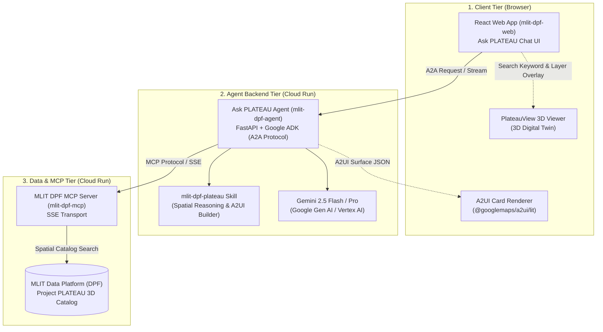

# Ask PLATEAU mlit-dpf-agent

## Overview

**"Ask PLATEAU" (`mlit-dpf-agent`)** refers to a conversational chat service designed to utilize PLATEAU geospatial data available on the Ministry of Land, Infrastructure, Transport and Tourism (MLIT) Data Platform (DPF). Users can ask questions in natural language to receive answers, identify geospatial datasets, and execute spatial queries.

> ⚠️ **Disclaimer:** This is an unofficial community project and is not officially affiliated with or endorsed by the Ministry of Land, Infrastructure, Transport and Tourism (MLIT).

---

## Documentation

> 📖 **Note:** The documentation below is provided in **Japanese only**.

For detailed capabilities and getting started guides, see:
- [Overview & Capabilities (概要)](docs/overview.md) *(Japanese)*
- [Get Started & Benchmark Prompts (使ってみる)](docs/get-started.md) *(Japanese)*

---

## System Architecture



### Key Components

- **Frontend (`mlit-dpf-web`)**:
  - React + TypeScript + Vite with `@googlemaps/a2ui/lit` integration.
  - Side-by-side view combining interactive chat and PlateauView 3D.
- **Agent Backend (`mlit-dpf-agent`)**:
  - Powered by Google Agent Development Kit (ADK) and A2A protocol.
  - Implements the `mlit-dpf-plateau` skill for spatial reasoning and A2UI schema synthesis.
- **MCP Server (`mlit-dpf-mcp`)**:
  - Model Context Protocol (MCP) server providing real-time access to the MLIT Data Platform.

---

## Project Structure

```
mlit-dpf-agent/
├── app/                       # Core agent code
│   ├── agent.py               # Main agent logic & orchestration
│   ├── mlit_agent.py          # MLIT DPF specialized agent (SSE MCP client)
│   ├── fast_api_app.py        # FastAPI Backend server
│   ├── skills/                # Project PLATEAU 3D A2UI Skill & schemas
│   └── app_utils/             # App utilities and helpers
├── client/web/react/          # React Web UI (A2A Client + Cesium 3D + A2UI Cards)
├── assets/                    # Screenshots & media assets
├── tests/                     # Unit, integration, and E2E tests
├── LICENSE.md                 # Apache 2.0 License
├── GEMINI.md                  # AI-assisted development guide
└── pyproject.toml             # Project dependencies
```

---

## Requirements

Before you begin, ensure you have:
* **uv**: Python package manager - [Install](https://docs.astral.sh/uv/getting-started/installation/)
* **agents-cli**: Google Agents CLI - `uv tool install google-agents-cli`
* **Google Cloud SDK**: For Vertex AI - [Install](https://cloud.google.com/sdk/docs/install)
* **MLIT DPF MCP Server**: Running `mlit-dpf-mcp` instance (SSE endpoint)

---

## Environment Setup

Configure your `.env` file before running the agent:

```bash
cp .env.example .env
```

Ensure the following variables are configured in `.env`:

```env
# Vertex AI Configuration (default)
GOOGLE_GENAI_USE_VERTEXAI=true
GOOGLE_CLOUD_PROJECT=your-gcp-project-id
GOOGLE_CLOUD_LOCATION=global

# MLIT DPF MCP Server URL (SSE)
MLIT_MCP_SERVER_URL=http://localhost:8000/sse
```

---

## Local Development

To run the complete 3-tier system on your local machine:

### 1. Step 1: Run MLIT DPF MCP Server (Local)
In the MCP server repository, install dependencies and start the SSE server:

```bash
cd ../mlit-dpf-mcp
uv sync
uv run python src/server.py
```
* **Local SSE Endpoint**: `http://localhost:8000/sse`

---

### 2. Step 2: Run ADK Agent (Local)
In this repository (`mlit-dpf-agent`), launch the Project PLATEAU 3D Agent using either option below:

---

#### Option A: Full A2UI Web App Server (Recommended for Map & Card UI)
Starts the FastAPI server with A2A / A2UI endpoints mounted on port 8080:
```bash
# Configure environment
cp .env.example .env

# Install dependencies
agents-cli install

# Run Project PLATEAU 3D Agent
uv run python -m app.fast_api_app
```
* **Local A2A RPC Endpoint**: `http://localhost:8080/a2a/app`
* **Agent Card**: `http://localhost:8080/a2a/app/.well-known/agent-card.json`

#### Option B: ADK CLI Playground (For Trace & Inspection)
Starts the ADK interactive developer UI on port 8080:
```bash
agents-cli playground
```
* **Local Dev UI**: `http://127.0.0.1:8080/dev-ui/?app=app`

> **Note**: Both options listen on port 8080. Run either Option A or Option B, not both simultaneously.

---

### 3. Step 3: Run React Web UI (Local)
*(Required when using Option A)* In the React frontend directory, install dependencies and launch the Vite dev server:

```bash
cd client/web/react
npm install
npm run dev
```
* **Local Web Client**: `http://localhost:5173/`

---

## Production Deployment

The production deployment consists of 3 standalone Cloud Run services:
1. **MLIT DPF MCP Server** (`mlit-dpf-mcp`): Communicates with official MLIT data APIs via SSE.
2. **ADK Agent Server** (`mlit-dpf-agent`): Orchestrates Gemini LLM, MLIT MCP tools, and A2UI JSON output.
3. **React Web UI** (`client/web/react`): Frontend chat interface with A2UI maps and cards.

---

### 1. Enable Required GCP APIs

```bash
gcloud services enable \
  run.googleapis.com \
  cloudbuild.googleapis.com \
  artifactregistry.googleapis.com \
  secretmanager.googleapis.com \
  aiplatform.googleapis.com \
  cloudresourcemanager.googleapis.com \
  --project=shogoorg-mlit-dpf
```

---

### 2. Step 1: Deploy MLIT DPF MCP Server to Cloud Run

Deploy `mlit-dpf-mcp` as a standalone SSE service on Cloud Run:

```bash
cd ../mlit-dpf-mcp
gcloud run deploy mlit-dpf-mcp \
  --source . \
  --project shogoorg-mlit-dpf \
  --region us-west1 \
  --set-env-vars "MLIT_API_KEY=<your-mlit-api-key>,MLIT_BASE_URL=https://data-platform.mlit.go.jp/api/v1/" \
  --allow-unauthenticated
```

Note the service URL output (e.g., `https://mlit-dpf-mcp-<hash>-<region>.a.run.app`). The SSE endpoint will be:
`https://<your-mcp-server-endpoint>/sse`

---

### 3. Step 2: Deploy ADK Agent (`mlit-dpf-agent`) to Cloud Run

Deploy the agent using `agents-cli deploy`:

```bash
cd ../mlit-dpf-agent
agents-cli deploy \
  --project shogoorg-mlit-dpf \
  --region us-west1 \
  --no-confirm-project
```

#### Update Environment Variables & Public Access

Update the Cloud Run service with the deployed MCP server URL, set the active skill, and enable public access:

```bash
# Configure MCP Server URL on Cloud Run
gcloud run services update mlit-dpf-agent \
  --project shogoorg-mlit-dpf \
  --region us-west1 \
  --update-env-vars "MLIT_MCP_SERVER_URL=https://<your-mcp-server-endpoint>/sse"

# Grant public invoker access
gcloud run services add-iam-policy-binding mlit-dpf-agent \
  --member="allUsers" \
  --role="roles/run.invoker" \
  --project shogoorg-mlit-dpf \
  --region us-west1
```

#### Verification Endpoints
* **Web UI (ADK Dev UI)**: `https://<your-agent-endpoint>/dev-ui/?app=app`
* **A2A Agent Card**: `https://<your-agent-endpoint>/a2a/app/.well-known/agent-card.json`
* **A2A RPC Endpoint**: `https://<your-agent-endpoint>/a2a/app`

---

### 4. Step 3: Deploy React Web UI (`client/web/react`) to Cloud Run

To deploy the React web client to Cloud Run:

```bash
cd client/web/react

# Deploy directly with Cloud Run source deploy
gcloud run deploy mlit-dpf-web \
  --source . \
  --project shogoorg-mlit-dpf \
  --region us-west1 \
  --set-env-vars "VITE_A2A_SERVER_URL=https://<your-agent-endpoint>/a2a/app,VITE_GOOGLE_MAPS_API_KEY=<your-maps-api-key>" \
  --allow-unauthenticated
```

#### Verification Endpoints
* **React Web UI**: `https://<your-web-ui-endpoint>`

---

## Commands

| Command | Description |
| :--- | :--- |
| `agents-cli install` | Install dependencies using uv |
| `agents-cli playground` | Launch local development environment (interactive UI) |
| `uv run pytest tests/unit tests/integration` | Run unit, agent stream, and E2E integration tests |
| `agents-cli lint` | Run code quality checks |
| `agents-cli eval` | Run agent evaluation datasets and grade traces |
| `agents-cli deploy` | Deploy agent to Cloud Run |
