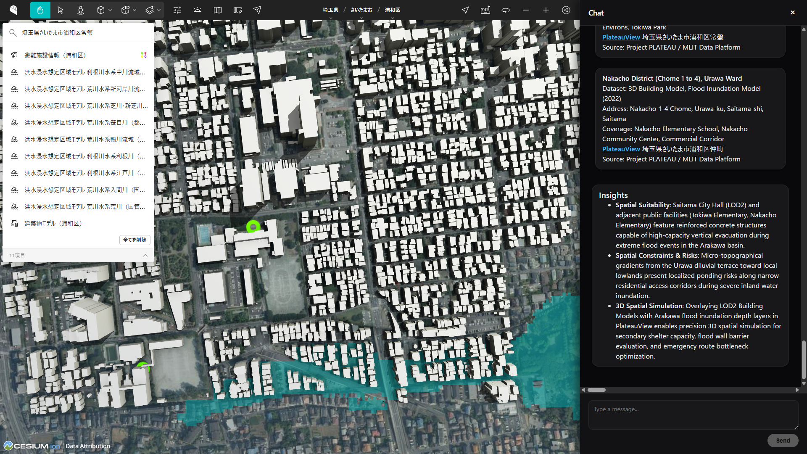
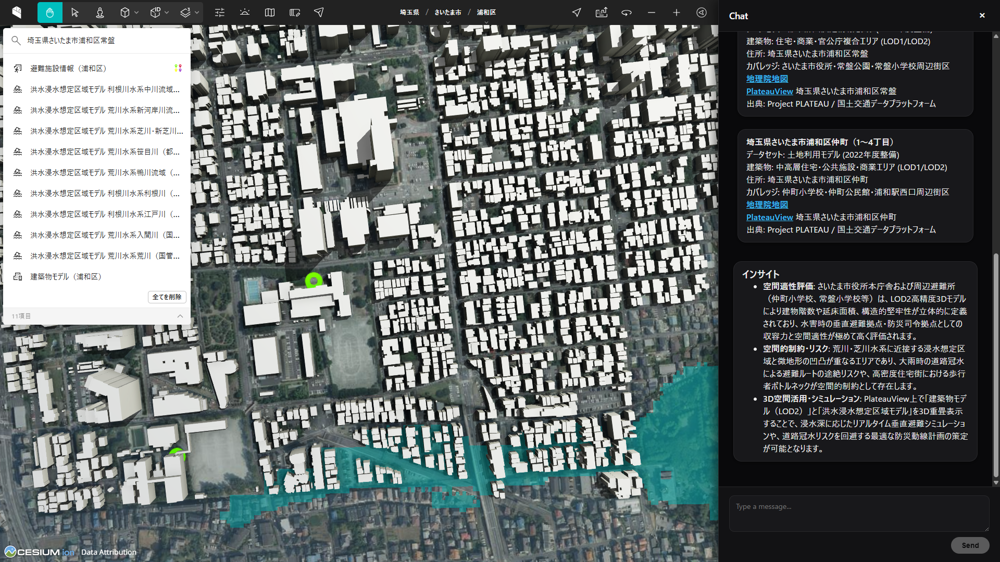
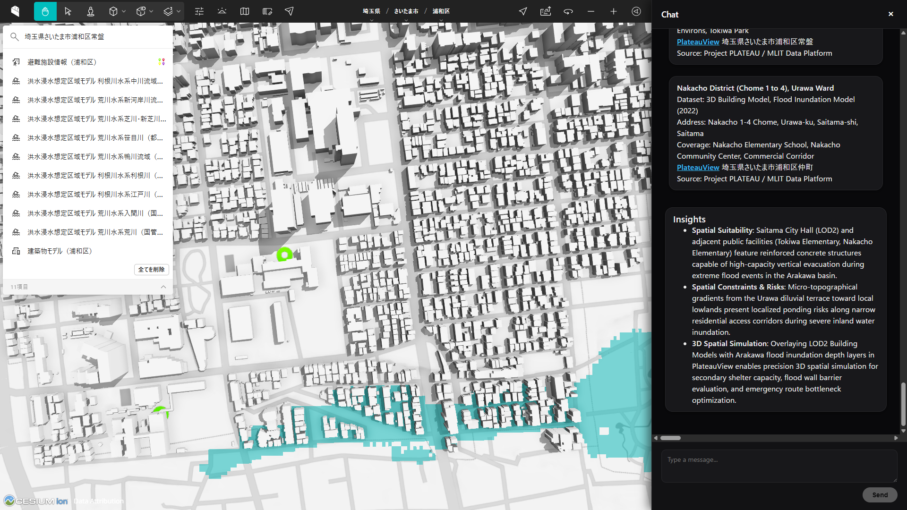
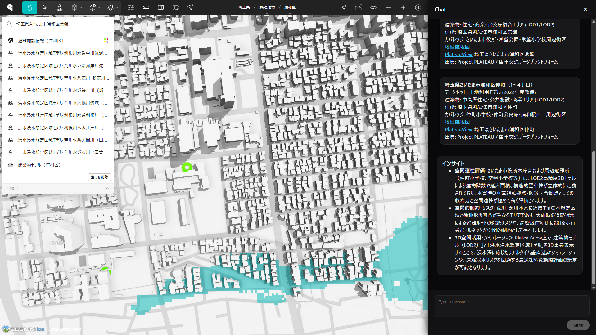

# mlit-dpf-agent

## Overview

**`mlit-dpf-agent`** is an AI-native spatial intelligence agent built with **Google ADK** (Agent Development Kit), **A2A**, and **A2UI**, integrating **`mlit-dpf-mcp`** to ground Gemini in official public data from Japan's Ministry of Land, Infrastructure, Transport and Tourism (MLIT) and **Project PLATEAU 3D**.

```
[ User Query ] ⇄ [ mlit-dpf-agent (ADK / Gemini) ]
                         └── [ mlit-dpf-mcp ] ⇄ [ MLIT DPF API ] ➔ [ PlateauView 3D ]
```

> ⚠️ **Disclaimer:** This is an unofficial community project and is not officially affiliated with or endorsed by the Ministry of Land, Infrastructure, Transport and Tourism (MLIT).

---

## Key Features: The 3 Core Pillars of Value

1. **Multilingual (Global & Inclusive Access)**:
   - Breaks linguistic barriers by automatically detecting input languages (English, Japanese, etc.) and dynamically generating bilingual A2UI cards and OGC spatial insights.
2. **Factuality (Authoritative Public Grounding)**:
   - Zero-hallucination spatial intelligence strictly grounded in sovereign open government data from MLIT DPF & Project PLATEAU (LOD1/LOD2 3D models, statutory hazard zones, GSI maps).
3. **Reasoning (Spatial & Intent Logic)**:
   - High-order spatial reasoning that transforms natural conversational objectives into multi-layered spatial analysis and actionable 3D digital twin simulations.

---

## Core Capabilities (主要機能)

1. **Search系 (複数対象・範囲検索 / Multi-Entity Spatial Search)**:
   - Executes multi-entity spatial exploration across **Datasets** (`bldg`, `fld`, `urf`), **Buildings** (LOD2 facilities, shelters), and **Addresses** via radius proximity, bounding boxes, keywords, and attribute filters with dynamic map & card rendering.
2. **Get系 (詳細・データ取得系 / Deep-Dive Data Retrieval)**:
   - Retrieves full facility specifications, metadata summaries, direct 3D model downloads (CityGML / 3D Tiles), ZIP archives, thumbnail previews, mesh units, and administrative code normalizations.
3. **統合系 (自律エージェント・探索＆深掘り / Autonomous Synthesis & Reasoning)**:
   - Autonomously orchestrates the entire spatial exploration pipeline—progressing from macro datasets down to micro facility specs—and generates OGC-compliant 3D spatial intelligence insights (Spatial Suitability, Constraints & Risks, 3D Simulation).

---

## Known Limitations & Design Decisions (既知の制約事項と設計判断)

* **PlateauView 3D Localization & URL Deep Linking**:
  * **No Multi-language Support**: The official [PlateauView 3D](https://plateauview.mlit.go.jp/) platform is currently provided in Japanese only. When queries are made in English or other languages, the agent automatically supplies the exact official Japanese address/keyword in parentheses (e.g., `(Search with "埼玉県さいたま市浦和区常盤6-4-4")`) to facilitate 3D model search.
  * **No URL Query Parameters**: Since PlateauView 3D does not currently support direct coordinate parameters via URL query strings, the agent links to the top portal while instructing users with the precise search keyword.

---

## Project Structure

```
mlit-dpf-agent/
├── app/                       # Core agent code
│   ├── agent.py               # Main agent logic & orchestration
│   ├── mlit_agent.py          # MLIT DPF specialized agent (SSE MCP client)
│   ├── fast_api_app.py        # FastAPI Backend server
│   └── app_utils/             # App utilities and helpers
├── skills/                    # Agent Skills (MLIT DPF)
│   ├── README.md              # Skills catalog
│   └── mlit-data-plathome/    # MLIT DPF MCP skill
├── tests/                     # Unit, integration, and E2E tests
├── GEMINI.md                  # AI-assisted development guide
└── pyproject.toml             # Project dependencies
```

---

## Requirements

Before you begin, ensure you have:
* **uv**: Python package manager - [Install](https://docs.astral.sh/uv/getting-started/installation/)
* **agents-cli**: Google Agents CLI - `uv tool install google-agents-cli`
* **Google Cloud SDK**: For Vertex AI - [Install](https://cloud.google.com/sdk/docs/install)
* **MLIT DPF MCP Server**: Running `mlit-dpf-mcp` instance (SSE endpoint)

---

## Environment Setup

Configure your `.env` file before running the agent:

```bash
cp .env.example .env
```

Ensure the following variables are configured in `.env`:

```env
# Vertex AI Configuration (default)
GOOGLE_GENAI_USE_VERTEXAI=true
GOOGLE_CLOUD_PROJECT=your-gcp-project-id
GOOGLE_CLOUD_LOCATION=global

# MLIT DPF MCP Server URL (SSE)
MLIT_MCP_SERVER_URL=http://localhost:8000/sse
```

---

## Local Development (ローカル開発・実行)

To run the complete 3-tier system on your local machine:

### 1. Step 1: Run MLIT DPF MCP Server (Local)
In the MCP server repository, install dependencies and start the SSE server:

```bash
cd ../mlit-dpf-mcp
uv sync
uv run python src/server.py
```
* **Local SSE Endpoint**: `http://localhost:8000/sse`

---

### 2. Step 2: Run ADK Agent (Local)
In this repository (`mlit-dpf-agent`), launch the Project PLATEAU 3D Agent using either option below:

---

#### Option A: Full A2UI Web App Server (Recommended for Map & Card UI)
Starts the FastAPI server with A2A / A2UI endpoints mounted on port 8080:
```bash
# Configure environment
cp .env.example .env

# Install dependencies
agents-cli install

# Run Project PLATEAU 3D Agent
uv run python -m app.fast_api_app
```
* **Local A2A RPC Endpoint**: `http://localhost:8080/a2a/app`
* **Agent Card**: `http://localhost:8080/a2a/app/.well-known/agent-card.json`

#### Option B: ADK CLI Playground (For Trace & Inspection)
Starts the ADK interactive developer UI on port 8080:
```bash
agents-cli playground
```
* **Local Dev UI**: `http://127.0.0.1:8080/dev-ui/?app=app`

> **Note**: Both options listen on port 8080. Run either Option A or Option B, not both simultaneously.

---

### 3. Step 3: Run React Web UI (Local)
*(Required when using Option A)* In the React frontend directory, install dependencies and launch the Vite dev server:

```bash
cd client/web/react
npm install
npm run dev
```
* **Local Web Client**: `http://localhost:5173/`

---

## Production Deployment (Cloud Run 本番デプロイ)

The production deployment consists of 3 standalone Cloud Run services:
1. **MLIT DPF MCP Server** (`mlit-dpf-mcp`): Communicates with official MLIT data APIs via SSE.
2. **ADK Agent Server** (`mlit-dpf-agent`): Orchestrates Gemini LLM, MLIT MCP tools, and A2UI JSON output.
3. **React Web UI** (`client/web/react`): Frontend chat interface with A2UI maps and cards.

---

### 1. Enable Required GCP APIs

```bash
gcloud services enable \
  run.googleapis.com \
  cloudbuild.googleapis.com \
  artifactregistry.googleapis.com \
  secretmanager.googleapis.com \
  aiplatform.googleapis.com \
  cloudresourcemanager.googleapis.com \
  --project=shogoorg-mlit-dpf
```

---

### 2. Step 1: Deploy MLIT DPF MCP Server to Cloud Run

Deploy `mlit-dpf-mcp` as a standalone SSE service on Cloud Run:

```bash
cd ../mlit-dpf-mcp
gcloud run deploy mlit-dpf-mcp \
  --source . \
  --project shogoorg-mlit-dpf \
  --region us-west1 \
  --set-env-vars "MLIT_API_KEY=<your-mlit-api-key>,MLIT_BASE_URL=https://data-platform.mlit.go.jp/api/v1/" \
  --allow-unauthenticated
```

Note the service URL output (e.g., `https://mlit-dpf-mcp-<hash>-<region>.a.run.app`). The SSE endpoint will be:
`https://<your-mcp-server-endpoint>/sse`

---

### 3. Step 2: Deploy ADK Agent (`mlit-dpf-agent`) to Cloud Run

Deploy the agent using `agents-cli deploy`:

```bash
cd ../mlit-dpf-agent
agents-cli deploy \
  --project shogoorg-mlit-dpf \
  --region us-west1 \
  --no-confirm-project
```

#### Update Environment Variables & Public Access

Update the Cloud Run service with the deployed MCP server URL, set the active skill, and enable public access:

```bash
# Configure MCP Server URL on Cloud Run
gcloud run services update mlit-dpf-agent \
  --project shogoorg-mlit-dpf \
  --region us-west1 \
  --update-env-vars "MLIT_MCP_SERVER_URL=https://<your-mcp-server-endpoint>/sse"

# Grant public invoker access
gcloud run services add-iam-policy-binding mlit-dpf-agent \
  --member="allUsers" \
  --role="roles/run.invoker" \
  --project shogoorg-mlit-dpf \
  --region us-west1
```

#### Verification Endpoints
* **Web UI (ADK Dev UI)**: `https://<your-agent-endpoint>/dev-ui/?app=app`
* **A2A Agent Card**: `https://<your-agent-endpoint>/a2a/app/.well-known/agent-card.json`
* **A2A RPC Endpoint**: `https://<your-agent-endpoint>/a2a/app`

---

### 4. Step 3: Deploy React Web UI (`client/web/react`) to Cloud Run

To deploy the React web client to Cloud Run:

```bash
cd client/web/react

# Deploy directly with Cloud Run source deploy
gcloud run deploy mlit-dpf-web \
  --source . \
  --project shogoorg-mlit-dpf \
  --region us-west1 \
  --set-env-vars "VITE_A2A_SERVER_URL=https://<your-agent-endpoint>/a2a/app,VITE_GOOGLE_MAPS_API_KEY=<your-maps-api-key>" \
  --allow-unauthenticated
```

#### Verification Endpoints
* **React Web UI**: `https://<your-web-ui-endpoint>`

---

## Commands

| Command | Description |
| :--- | :--- |
| `agents-cli install` | Install dependencies using uv |
| `agents-cli playground` | Launch local development environment (interactive UI) |
| `uv run pytest tests/unit tests/integration` | Run unit, agent stream, and E2E integration tests |
| `agents-cli lint` | Run code quality checks |
| `agents-cli eval` | Run agent evaluation datasets and grade traces |
| `agents-cli deploy` | Deploy agent to Cloud Run |

---

## Interactive A2UI Experience & Benchmark Prompts

The agent delivers agent-driven dynamic UIs using the [A2UI (Agent-to-User Interface)](https://github.com/googlemaps/a2ui) specification, with UI components and catalog schemas adapted from the [A2UI Samples](https://github.com/googlemaps-samples/a2ui) repository.

### 1. Search系（複数対象・範囲検索）

1. **検索 (Search)**
   * 「**＜さいたま市役所、藤沢市役所、京都市役所、舞鶴市役所＞周辺**の**＜建築物、住所＞**」
   * *(English: "Buildings and addresses around <Saitama City Hall, Fujisawa City Hall, Kyoto City Hall, Maizuru City Hall>")*

2. **位置矩形による検索 (Search by Location Rectangle)**
   * ①「**＜さいたま市役所、藤沢市役所、京都市役所、舞鶴市役所＞から＜浦和駅、藤沢駅、京都駅、東舞鶴駅＞にかけてのエリア**の**＜建築物、住所＞**」
   * *(English: "Buildings and addresses in the area spanning from <Saitama City Hall, Fujisawa City Hall, Kyoto City Hall, Maizuru City Hall> to <Urawa Station, Fujisawa Station, Kyoto Station, Higashi-Maizuru Station>")*
   * ②（緯度経度指定時）「**＜さいたま市役所、藤沢市役所、京都市役所、舞鶴市役所＞周辺**の緯度経度範囲＜**北緯35.85〜35.87、東経139.64〜139.66**＞の**＜建築物、住所＞**」
   * *(English: "Buildings and addresses within coordinate bounding box <Lat 35.85-35.87, Lon 139.64-139.66> around <Saitama City Hall, Fujisawa City Hall, Kyoto City Hall, Maizuru City Hall>")*

3. **位置地点と距離による検索 (Search by Location Point Distance)**
   * 「**＜さいたま市役所、藤沢市役所、京都市役所、舞鶴市役所＞周辺**から半径＜**1km以内**＞の**＜建築物、住所＞**」
   * *(English: "Buildings and addresses within <1km radius> around <Saitama City Hall, Fujisawa City Hall, Kyoto City Hall, Maizuru City Hall>")*

4. **属性による検索 (Search by Attribute)**
   * ①「**＜さいたま市浦和区、藤沢市、京都市中京区、舞鶴市＞**の**＜建築物、住所＞**」
   * *(English: "Buildings and addresses in <Urawa Ward (Saitama), Fujisawa City, Nakagyo Ward (Kyoto), Maizuru City>")*
   * ②（施設種別指定時）「**＜さいたま市、藤沢市、京都市、舞鶴市＞**の＜**公共施設（庁舎、学校、避難施設）**＞の**建築物**」
   * *(English: "<Public facilities (city halls, schools, evacuation shelters)> in <Saitama City, Fujisawa City, Kyoto City, Maizuru City>")*

---

### 2. Get系（詳細・データ取得系）

5. **データ取得 (Get Data)**
   * 「**＜さいたま市役所、藤沢市役所、京都市役所、舞鶴市役所＞**の**＜建築物、住所＞ さらに詳しく**」
   * *(English: "<buildings, addresses> of <Saitama City Hall, Fujisawa City Hall, Kyoto City Hall, Maizuru City Hall> Learn more")*

6. **データサマリー取得 (Get Data Summary)**
   * 「**＜さいたま市役所、藤沢市役所、京都市役所、舞鶴市役所＞**の**＜建築物、住所＞の基本情報 さらに詳しく**」
   * *(English: "Basic information on <buildings, addresses> of <Saitama City Hall, Fujisawa City Hall, Kyoto City Hall, Maizuru City Hall> Learn more")*

7. **データカタログ取得 (Get Data Catalog)**
   * 「**＜さいたま市、藤沢市、京都市、舞鶴市＞**の**データセット（カテゴリー） さらに詳しく**」
   * *(English: "Datasets (categories) of <Saitama City, Fujisawa City, Kyoto City, Maizuru City> Learn more")*

8. **データカタログサマリー取得 (Get Data Catalog Summary)**
   * 「**＜さいたま市、藤沢市、京都市、舞鶴市＞**の**データセット（カテゴリー）のサマリー さらに詳しく**」
   * *(English: "Summary of datasets (categories) of <Saitama City, Fujisawa City, Kyoto City, Maizuru City> Learn more")*

9. **ファイルダウンロードURL取得 (Get File Download URLs)**
   * 「**＜さいたま市役所、藤沢市役所、京都市役所、舞鶴市役所＞**の**＜建築物、住所＞のダウンロードURL さらに詳しく**」
   * *(English: "Download URLs for <buildings, addresses> of <Saitama City Hall, Fujisawa City Hall, Kyoto City Hall, Maizuru City Hall> Learn more")*

10. **ZIPファイルダウンロードURL取得 (Get Zipfile Download URL)**
    * 「**＜さいたま市役所、藤沢市役所、京都市役所、舞鶴市役所＞**の**＜建築物、住所＞のZIPダウンロードURL さらに詳しく**」
    * *(English: "ZIP download URL for <buildings, addresses> of <Saitama City Hall, Fujisawa City Hall, Kyoto City Hall, Maizuru City Hall> Learn more")*

11. **サムネイルURL取得 (Get Thumbnail URLs)**
    * 「**＜さいたま市役所、藤沢市役所、京都市役所、舞鶴市役所＞**の**建築物のサムネイルURL さらに詳しく**」
    * *(English: "Thumbnail URLs for buildings of <Saitama City Hall, Fujisawa City Hall, Kyoto City Hall, Maizuru City Hall> Learn more")*

12. **全データ取得 (Get All Data)**
    * 「**＜さいたま市、藤沢市、京都市、舞鶴市＞**の**＜建築物、住所＞の全件データ さらに詳しく**」
    * *(English: "All data records for <buildings, addresses> of <Saitama City, Fujisawa City, Kyoto City, Maizuru City> Learn more")*

13. **カウントデータ取得 (Get Count Data)**
    * 「**＜さいたま市、藤沢市、京都市、舞鶴市＞**の**＜建築物、住所＞の登録件数 さらに詳しく**」
    * *(English: "Record counts of <buildings, addresses> in <Saitama City, Fujisawa City, Kyoto City, Maizuru City> Learn more")*

14. **サジェスト取得 (Get Suggest)**
    * 「『**＜さいたま市役所、藤沢市役所、京都市役所、舞鶴市役所＞**』の**＜建築物、住所＞のサジェスト候補 さらに詳しく**」
    * *(English: "Search suggestions for <buildings, addresses> of '<Saitama City Hall, Fujisawa City Hall, Kyoto City Hall, Maizuru City Hall>' Learn more")*

15. **都道府県データ取得 (Get Prefecture Data)**
    * 「**＜埼玉県、神奈川県、京都府＞**の**都道府県情報 さらに詳しく**」
    * *(English: "Prefecture information for <Saitama, Kanagawa, Kyoto> Learn more")*

16. **市区町村データ取得 (Get Municipality Data)**
    * 「**＜さいたま市、藤沢市、京都市、舞鶴市＞**の**市区町村情報 さらに詳しく**」
    * *(English: "Municipality information for <Saitama City, Fujisawa City, Kyoto City, Maizuru City> Learn more")*

17. **メッシュ取得 (Get Mesh)**
    * ①「**＜さいたま市役所、藤沢市役所、京都市役所、舞鶴市役所＞がある＜1kmメッシュ（地域区画）＞**の**＜建築物、住所＞ さらに詳しく**」
    * *(English: "<buildings, addresses> in the <1km regional mesh grid> of <Saitama City Hall, Fujisawa City Hall, Kyoto City Hall, Maizuru City Hall> Learn more")*
    * ②（メッシュコード指定時）「地域メッシュコード＜**53394523**＞内の**＜建築物、住所＞ さらに詳しく**」
    * *(English: "<buildings, addresses> within regional mesh code <53394523> Learn more")*

18. **コード正規化 (Normalize Codes)**
    * 「**＜埼玉県さいたま市、神奈川県藤沢市、京都府京都市、京都府舞鶴市＞**の**都道府県名と市区町村名 正規化**」
    * *(English: "Normalize prefecture and municipality names of <Saitama City (Saitama), Fujisawa City (Kanagawa), Kyoto City (Kyoto), Maizuru City (Kyoto)>")*

---

### 3. 統合系（自律エージェント・探索＆深掘り）

* **抽象バージョン (Abstract Baseline)**:
  * 「**＜さいたま市役所、藤沢市役所、京都市役所、舞鶴市役所＞周辺**の**＜データセット、建築物、住所＞ さらに詳しく**」
  * *(English: "<datasets, buildings, addresses> around <Saitama City Hall, Fujisawa City Hall, Kyoto City Hall, Maizuru City Hall> Learn more")*

* **具体バージョン (Concrete Scenario: 洪水データ・避難所・住所)**:
  * 「**＜さいたま市役所、藤沢市役所、京都市役所、舞鶴市役所＞周辺**の**＜洪水データ、避難所、住所＞ さらに詳しく**」
  * *(English: "<flood data, evacuation shelters, addresses> around <Saitama City Hall, Fujisawa City Hall, Kyoto City Hall, Maizuru City Hall> Learn more")*

---

> 💡 **Learn more about A2UI:**  
> For the core protocol and Web Components library, visit the [googlemaps/a2ui](https://github.com/googlemaps/a2ui) repository.  
> For reference design patterns and full-stack integration examples, visit [googlemaps-samples/a2ui](https://github.com/googlemaps-samples/a2ui).

---

## UI Experience & Autonomous Agent Demonstrations

### 1. 3D Spatial Intelligence with PlateauView & Hazard Overlay (Satellite View)

#### 🌐 English Query Experience

> **User Prompt**:
> `<flood data, evacuation shelters, addresses> around <Saitama City Hall> Learn more`
>
> **Agent Response & A2UI Surface**:
> * **Flood Inundation Model (Saitama City Urawa Ward)**
>   * Dataset: Flood Inundation Model (2022) / Address: Saitama City Urawa Ward Tokiwa 6-4-4 Area
>   * Coverage: Arakawa & Shibakawa River Systems Inundation Zone
>   * [[GSI Map]](https://maps.gsi.go.jp/?marker=35.8616,139.6455) / [[PlateauView]](https://plateauview.mlit.go.jp/) `洪水浸水想定区域モデル 埼玉県 さいたま市浦和区`
>   * *Source: Project PLATEAU / MLIT Data Platform*
> * **Saitama City Hall Main Building**
>   * Dataset: 3D Building Model (2022) / Building: Government Facility (LOD2) / Address: Saitama City Urawa Ward Tokiwa 6-4-4
>   * [[GSI Map]](https://maps.gsi.go.jp/?marker=35.8616,139.6455) / [[PlateauView]](https://plateauview.mlit.go.jp/) `埼玉県さいたま市浦和区常盤`
>   * *Source: Project PLATEAU / MLIT Data Platform*
> * **Nakacho District (Chome 1 to 4), Urawa Ward**
>   * Dataset: 3D Building Model, Flood Inundation Model (2022) / Address: Nakacho 1-4 Chome, Urawa-ku, Saitama-shi, Saitama
>   * Coverage: Nakacho Elementary School, Nakacho Community Center, Commercial Corridor
>   * [[GSI Map]](https://maps.gsi.go.jp/?marker=35.8614,139.6499) / [[PlateauView]](https://plateauview.mlit.go.jp/) `埼玉県さいたま市浦和区仲町`
>   * *Source: Project PLATEAU / MLIT Data Platform*
>
> **Insights**:
> * **Spatial Suitability**: Saitama City Hall (LOD2) and adjacent public facilities (Tokiwa Elementary, Nakacho Elementary) feature reinforced concrete structures capable of high-capacity vertical evacuation during extreme flood events in the Arakawa basin.
> * **Spatial Constraints & Risks**: Micro-topographical gradients from the Urawa diluvial terrace toward local lowlands present localized ponding risks along narrow residential access corridors during severe inland water inundation.
> * **3D Spatial Simulation**: Overlaying LOD2 Building Models with Arakawa flood inundation depth layers in PlateauView enables precision 3D spatial simulation for secondary shelter capacity, flood wall barrier evaluation, and emergency route bottleneck optimization.



---

#### 🗾 Japanese Query Experience

> **ユーザープロンプト**:
> `＜さいたま市役所＞周辺の＜洪水、避難所、住所＞ さらに詳しく`
>
> **エージェント応答 ＆ A2UI サーフェス**:
> * **洪水浸水想定区域モデル（埼玉県さいたま市浦和区）**
>   * データセット: 洪水浸水想定区域モデル (2022年度整備) / 住所: 埼玉県さいたま市浦和区常盤6-4-4 周辺
>   * [[地理院地図]](https://maps.gsi.go.jp/?marker=35.8616,139.6455) / [[PlateauView]](https://plateauview.mlit.go.jp/) `洪水浸水想定区域モデル 埼玉県 さいたま市浦和区`
>   * *出典: Project PLATEAU / 国土交通データプラットフォーム*
> * **さいたま市役所 本庁舎**
>   * データセット: 建築物モデル (2022年度整備) / 建築物: 行政庁舎・防災拠点 (LOD2) / 住所: 埼玉県さいたま市浦和区常盤6-4-4
>   * [[地理院地図]](https://maps.gsi.go.jp/?marker=35.8616,139.6455) / [[PlateauView]](https://plateauview.mlit.go.jp/) `埼玉県さいたま市浦和区常盤`
>   * *出典: Project PLATEAU / 国土交通データプラットフォーム*
> * **埼玉県さいたま市浦和区仲町（1〜4丁目）**
>   * データセット: 土地利用モデル (2022年度整備) / 建築物: 中高層住宅・公共施設・商業エリア (LOD1/LOD2) / 住所: 埼玉県さいたま市浦和区仲町
>   * カバレッジ: 仲町小学校・仲町公民館・浦和駅西口周辺街区
>   * [[地理院地図]](https://maps.gsi.go.jp/?marker=35.8614,139.6499) / [[PlateauView]](https://plateauview.mlit.go.jp/) `埼玉県さいたま市浦和区仲町`
>   * *出典: Project PLATEAU / 国土交通データプラットフォーム*
>
> **インサイト**:
> * **空間適性評価**: さいたま市役所本庁舎および周辺避難所（仲町小学校、常盤小学校等）は、LOD2高精度3Dモデルにより建物階数や延床面積、構造的堅牢性が立体的に定義されており、水害時の垂直避難拠点・防災司令拠点としての収容力と空間適性が極めて高く評価されます。
> * **空間的制約・リスク**: 荒川・芝川水系に近接する浸水想定区域と微地形の凹凸が重なるエリアであり、大雨時の道路冠水による避難ルートの途絶リスクや、高密度住宅街における歩行者ボトルネックが空間的制約として存在します。
> * **3D空間活用・シミュレーション**: PlateauView上で「建築物モデル（LOD2）」と「洪水浸水想定区域モデル」を3D重畳表示することで、浸水深に応じたリアルタイム垂直避難シミュレーションや、道路冠水リスクを回避する最適な防災動線計画の策定が可能となります。



---

### 2. 3D Spatial Intelligence with PlateauView & Hazard Overlay (Vector Map View)

* **English Query Experience**:


* **Japanese Query Experience**:


---

## License

This project is licensed under the Apache License 2.0 - see the [LICENSE.md](LICENSE.md) file for details.
